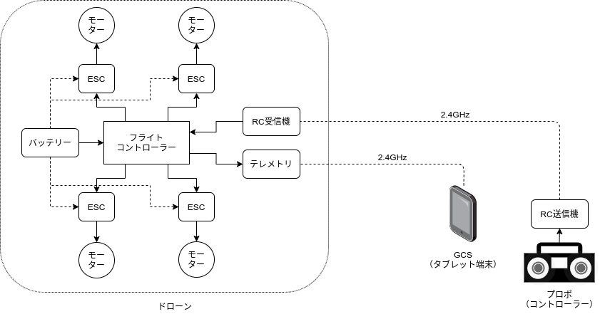
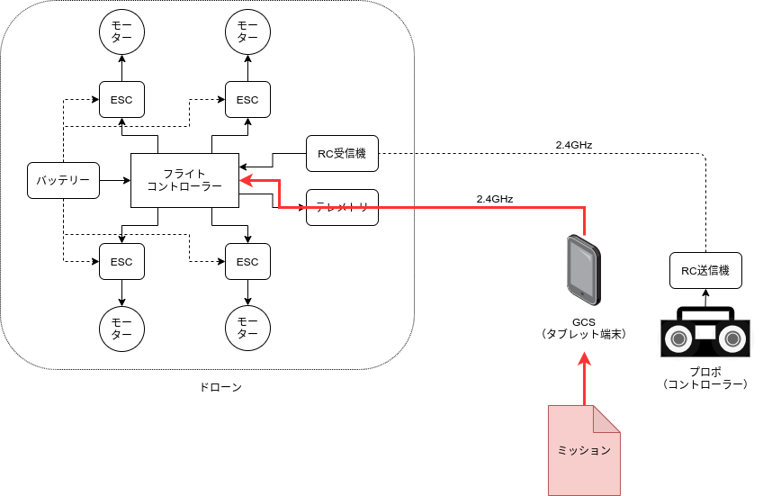
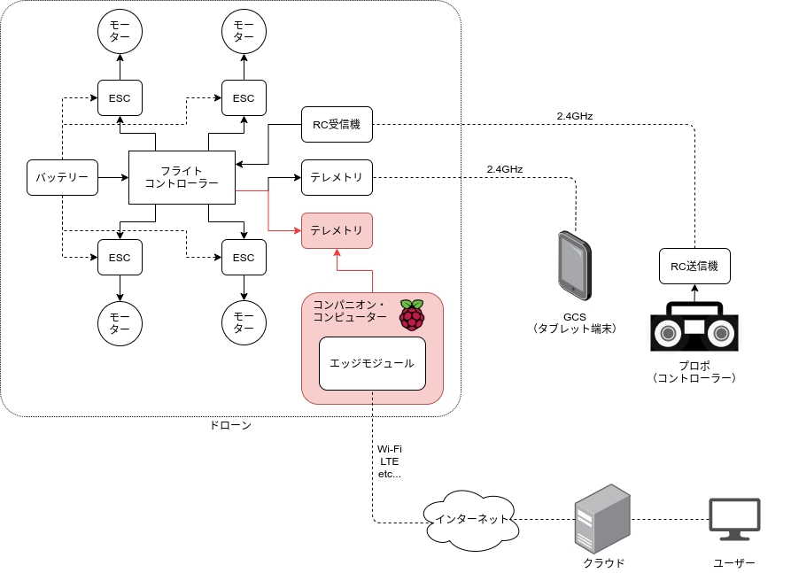

# 【導入編】ドローン・ソフトウェアが解決するもの

Skysignを理解するためには、まずはドローンとその周辺状況を理解することが重要です。  
当ドキュメントでは、ドローンの簡単な機器構成と、基本的なビルトイン機能について説明し、
最後に、Skysignがそれらをどのように扱い、どこを目指しているか、説明します。

## ドローンと地上局(GCS)
ドローンの簡単な構成図を以下に示します。

ドローンは、基本的には、プロポと呼ばれるコントローラーで操縦します。  
ドローン本体には、フライトコントローラーと呼ばれる、いわゆるドローンの頭脳にあたる機器が
組み込まれています。  
フライトコントローラーは、GPSやIMU（慣性計測装置）といったセンサー機器から計測値を受け取り、
飛行の位置や姿勢をリアルタイムに計算し、ESCを通してモーターの回転数を調整して、
飛行を制御します。  
多くのセンサー類とモーターをインテリジェントに連携しているため、
自律して安定した飛行を実現することができます。

GCSは、フライトコントローラーから取得できる、センサー機器の計測値（テレメトリー）
を無線で受信し、パイロットに提供することで操縦を支援する、地上局ソフトウェアです。  
GCSは、パイロットがドローンの状態を把握するためにも使用しますが、
パイロットからドローンに向けて、飛行の指示を送信することもできます。

以下は、オープンソースのGCSの一つである[QGC](http://qgroundcontrol.com/)の
スクリーンショット（公式より転載）です。

画像中央やや右よりに、赤い三角形が見えますが、これがドローンの現在位置です。  
テレメトリーに含まれる緯度・経度、機首の方位を地図にマッピングすることで、
このようにドローンの現在地を表現することができます。  
右上には、高度や速度、姿勢や方位なども表示されており、パイロットはこれらの情報も参考に、
ドローンの操縦を行います。

## ウェイポイント飛行とオートメーション化
QGCのスクリーンショットには、数字付きのオレンジ色のポイントと線が表示されています。  
これは、飛行経路を指定してドローンを自動飛行させる、ウェイポイント・ミッションという機能です。  
ウェイポイント・ミッションは、以下の図のように、GCSで飛行経路を作成し、
無線でフライトコントローラーに転送し、ドローンに自動飛行を指示します。

ミッションは、ドローンにあらかじめ組み込まれた機能であり、例えばDJI製品の機体では、
機種によって以下のように、複数の種類のミッションが提供されています。

[Missions - DJI Mobile SDK](https://developer.dji.com/mobile-sdk/documentation/introduction/component-guide-missions.html)

ウェイポイント・ミッションを応用すると、
例えば農業分野では、ほ場にまんべんなく農薬散布したり、上空からほ場全体の作物の
生育状況を確認するようなことができます。

以下のリンクは、DroneDeployという海外のドローンサービスのWebサイトですが、
ドローンを蛇行するように飛行させて、ほ場をまんべんなく撮影する様子が、
紹介されています。

[Agriculture Drone Software - DroneDeploy](https://www.dronedeploy.com/solutions/agriculture/)

ウェイポイント・ミッションを使用すれば、ドローン配送や防災分野など、
他にも様々な領域の自動化や効率化の向上が期待できます。

## インターネット×ドローンの可能性
ここまで見てきたように、ドローンの機能であるミッションとテレメトリーの活用により、
ドローンは多くの業務領域の自動化を実現する可能性を秘めています。

この可能性の実現を後押しする要素として、`ドローンとインターネットの接続`にも
触れないわけにはいきません。

特に、物流（ドローン配送）分野でのドローンの活用は、広域でドローンを運航することが想定され、
目視外飛行が前提となります。  
そのような状況下では、ドローンの状況をリアルタイムに遠隔で把握できる必要があり、
ドローンをインターネットに常時接続して運用することが想定されます。

以下の図は、ドローンとインターネットの接続の一つのパターンを示したものです。  
ドローンの機体上にRaspberry Piのようなシングルボードコンピュータを搭載して、
RPiがフライトコントローラーと、クラウドの間を中継する構成です。

よりセンサー類に近いところで、ある程度インテリジェントな処理を行い、
クラウドとの連携を効率的に処理する点で、
[エッジコンピューティング](https://ja.wikipedia.org/wiki/%E3%82%A8%E3%83%83%E3%82%B8%E3%82%B3%E3%83%B3%E3%83%94%E3%83%A5%E3%83%BC%E3%83%86%E3%82%A3%E3%83%B3%E3%82%B0)
の概念に近いものです。  
ドローン界隈では、AIによる画像解析などをエッジで行う例が、海外等から報告されています。

Skysignは、このようなドローンとインターネットの接続を実現し、
遠隔でドローンの制御と監視を行える、Webサービス・プラットフォームです。
