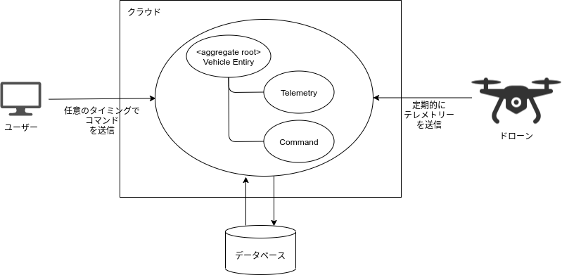
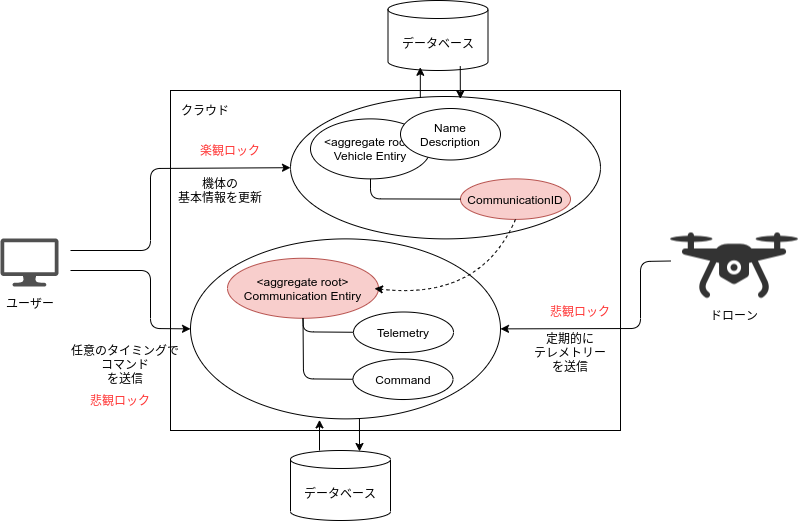

# 【本編1】ドローンの機体との遠隔コミュニケーション

当ドキュメントから全5回に分けて、SkysignのBackendを構成するコンポーネントの
アーキテクチャについて、説明していきます。  
Skysignでは、DDD(ドメイン駆動設計)を採用して、各コンポーネントを設計・実装しています。  
導入編で、ドローンの業務ドメインの知識と経験を紹介しましたので、それらも参考にしながら、
ドローンを遠隔制御・監視するソフトウェアの、ドメイン・モデルの発見と深化の過程を
追っていきましょう。

なお、当シリーズはドメイン・モデルの構築にフォーカスしたドキュメントのため、
ソースコードやレイヤー等の技術的な話題には触れません。
別の機会に文書化する予定です。

## ドローンの機体を表すエンティティ
Skysignのソフトウェアとしての強みは、ドローンを遠隔に制御・監視できることです。  
そのため、ドローン自身を表すエンティティ、およびその関連オブジェクトの集合が、
Skysignのコア・ドメインとなりそうです。

導入編で説明しましたが、ドローンとその関連要素として、`テレメトリー`と`ミッション`があります。
ミッションは次のドキュメントで紙面を割いて論じるので、ここでは簡単に、`コマンド`とします。  
コマンドは、パイロットからドローンに送られるもので、代表的なものとして、
`Return To Home (Launch)`や`Mission Start`があります。  
コマンドとテレメトリー、ドローン、ユーザー（パイロット）の関係を図示すると、
以下のようになります。

ドローンの機体（Vehicle）を、識別と追跡が可能なエンティティとして設け、
機体を集約ルートとして、テレメトリーとコマンドを集約に含めます。

機体と、テレメトリーとコマンドを常に一緒に扱うことで、
例えば、テレメトリー上の項目からドローンが特定の状態の場合のみ
送信できるコマンドのチェックなどができ、`強い整合性の関係`を作り出すことができます。

なお、ユーザーとドローン間の、コマンドとテレメトリーのやり取りの詳細は、
[こちら](../concepts.md)のドキュメントを参照してください。

## 競合する、人とドローンのエンティティ更新
一見、このドメイン・モデルは問題がないように見えますが、一点だけ議論のポイントがあります。

ドローンからのテレメトリー更新は、機械的に定期更新となり、そのタイミングは
基本的に1秒間に1回となります。  
よって、必然的にテレメトリー更新の排他制御は、`悲観ロック`による実装となります。

しかしながら、機体エンティティは、機体名や概要欄など、ユーザーが編集できる
いくつかの管理項目があり、画面から編集するため、`楽観ロック`で排他制御する必要があります。

> 楽観ロックと悲観ロック  
> 画面操作によるリソースの編集をする場合に、悲観ロックを採用することは、
> 一般的に推奨されていません。ロックの獲得時間はできる限り短く設計する
> ことが重要であり、ユーザーの操作の間にもロックを握らせてはいけません。  
> また、バッチ処理やタイマー処理等のコンピューター契機の処理では、
> 楽観ロックを採用するのも、やめたほうが良いでしょう。私の経験的な話ですが、
> 楽観ロックで処理失敗したところで、再実行等の考慮を設計することに
> 労力を割くのは無駄です。素直に、悲観ロックで設計したほうがシンプルになります。

同一エンティティを、異なるロック方法でデータ整合性を担保するのは困難であり、
どちらかのロック方式に統一しなければならないでしょう。  

## アイデンティティとステートを分離するというプラクティス
この問題に対処するためには、集約ルートを分割する必要があります。
つまり、業務ドメインの分析を行い、新しいエンティティを抽出し、ドメイン・モデルに追加します。

追加したのは、コミュニケーション・エンティティ（Communication）です。
以下の図は、集約ルートが機体とコミュニケーションに分割されたことを表しています。

コミュニケーション・エンティティは、ドローンとの通信を抽象化したもので、
コマンドの送受信、テレメトリーの送受信など、`ドローンとの意思疎通を管理`する
オブジェクトになります。

また、それぞれの集約ルートは、`異なるコンテキスト境界に属する`とみなすことで、
お互いの関係性がシンプルとなるため、参照は`識別子`でのみ行われます。

このようなドメイン・モデルの構成に整理することで、実は関係のない機体の名前と
テレメトリーを異なる文脈で扱うことができ、排他制御の問題と同時に、
`オブジェクトの凝集度`を高めることに繋がっています。

この集約ルートの分離は、見方を変えると、ドローンの`アイデンティティ`と`ステート`の分離を行い、
それをモデリングした結果であると言えます。  
機体の名前は、機体そのものの同一性の上で効果を発揮するものですし、
電源がOFFになるなどの、機体の状態が変化しても、変わるものではありません。

---

本編Part.1は、ここで終わりです。  
次のPart.2では、ドローンのもう一つの重要な要素である、ミッションのモデリングを
行っていきたいと思います。