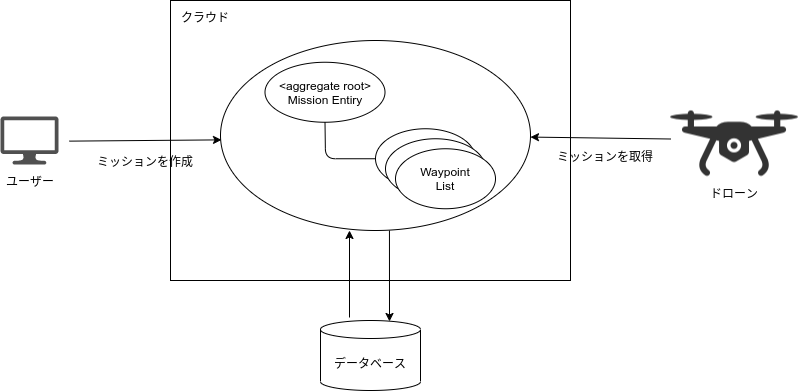
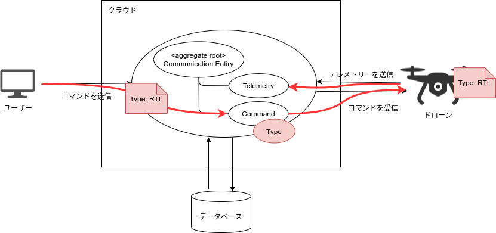
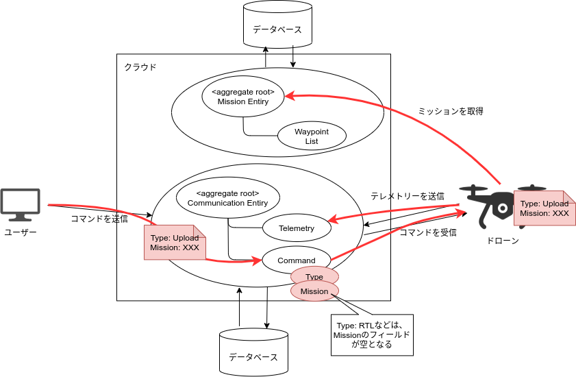
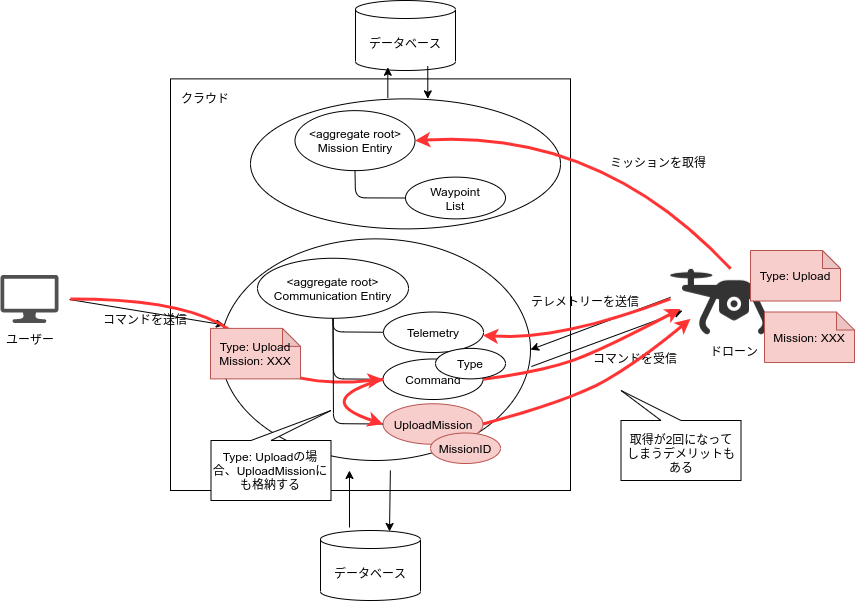

# 本編2 ウェイポイント飛行というドローンの重要任務

当ドキュメントでは、Skysignが提供する機能の一つである、ウェイポイント・ミッションに
関するドメイン・モデルの解説を行っていきます。

## ドローンがミッションを認識するために
Skysignでは、ウェイポイント・ミッションのみ対応しているため、ミッションの構成要素は、
ミッション本体と、ウェイポイント・リストの2つになります。  
本編1のドキュメントの機体とコミュニケーションの関係と同じく、
ミッションとウェイポイントリストは、
お互いに`アイデンティティとステートの関係`にありそうですが、こちらでは、
ミッションとウェイポイント・リストは、同じコンテキスト境界に含めるモデリングを行いました。  
現状、ミッションを編集する画面構成は簡素であり、ミッション本体とウェイポイント・リストは
必ず両方同時に更新するため、分離すると複雑さが増すためです。

ユーザーが作成したミッションを、ドローンがフライトコントローラーに書き込むために
クラウドから取得する図を以下に示します。

ミッションを集約ルートとすることで、ユーザーとドローンはお互いに識別子だけ
知っていれば、ミッションを認識できるようになります。

## コマンドとミッションを確実にドローンにデリバリーする
ユーザーがドローンに対して、実行してほしいミッションを伝えるためには、
どうすれば良いでしょうか？  
それを考えるにあたり、ユーザーがドローンにコマンドをデリバリーするシーケンスを、
いま一度確認してみましょう。

ユーザーからドローンへのコマンドのデリバリーは、コミュニケーション・エンティティの
役割になります。  
上図のように、ユーザーはコミュニケーション・エンティティにコマンドを格納すると、
ドローンはテレメトリー送信の契機でコマンドの存在をチェックし、存在していたら、
ドローンに配信します。

コマンドはTypeだけフィールドを持っているため、`Return To Home (Launch)`や、
`Arm / Disarm`、`Mission Start`などのコマンドの区分だけであれば、
ドローンに知らせることができます。

さて、それでは、ミッションのデリバリーはどうでしょうか？

ミッションをフライトコントローラーに書き込むためには、`Mission Upload`という
コマンドとともに、ウェイポイント・リストが必要になります。  
ウェイポイント・リストは、先ほどの説明の通り、別途ミッションの集約ルートを、
ドローン側から取得することで認識できますが、そのためには識別子が必要です。

しかし、ミッションの識別子は、Uploadコマンドだけ必要であって、他のコマンドの場合、
必要ありません。
そのため、コマンドのオブジェクトにミッションの識別子を含めてしまうと、
ドメイン・モデルとして、少し`凝集度が低い`モデルとなる気がします。  
（状況によっては、これでも問題ない可能性はありますね）

そこで、Skysignではコミュニケーション・エンティティに、`UploadMission`という、
新しいモデルを追加しました。  
コマンドと分離して、`コマンドの識別子とミッションの識別子をセット`で格納します。  
これにより、Uploadというコマンド区分の場合のみ存在するミッションの識別子を、
`コマンドの関心事から分離`でき、それぞれのオブジェクトの凝集度が上がります。

ドローン側から見ると、
1. テレメトリーをクラウドに送信
2. クラウドからコマンドを受信
3. コマンドのTypeがUploadだったら、UploadMissionを別途リクエスト
4. 取得したMissionの識別子を元に、ミッションをリクエスト
5. ミッションをフライトコントローラーに書き込む

というステップになり、3.のリクエストが余分に発生することがデメリットになります。  
この辺は、APIの設計をもう少し頑張れば、もっと効率的なコミュニケーションとなりそうです。

---

本編Part.2は、ここで終わりです。  
次のPart.3では、ドローンとミッションの機能が揃ったので、これらの機能を使った、
飛行の計画を立てる機能の説明に入っていきます。