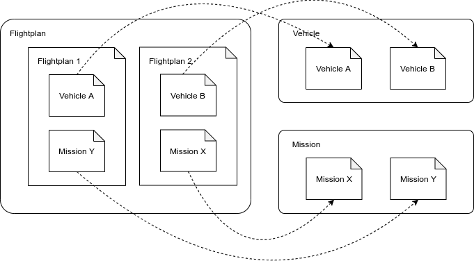
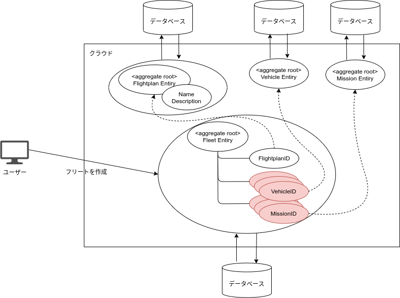
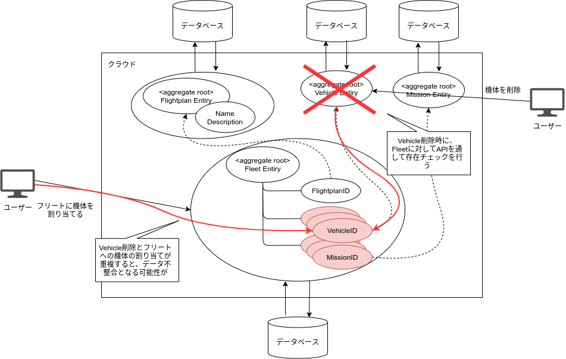
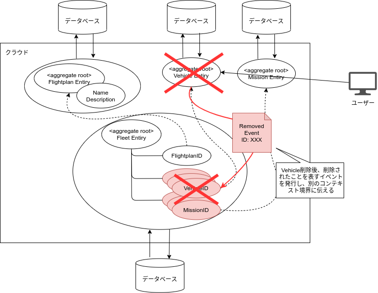
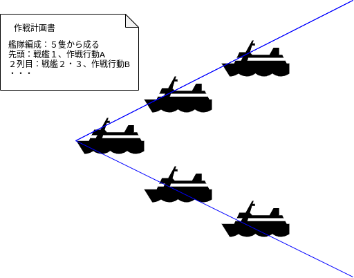
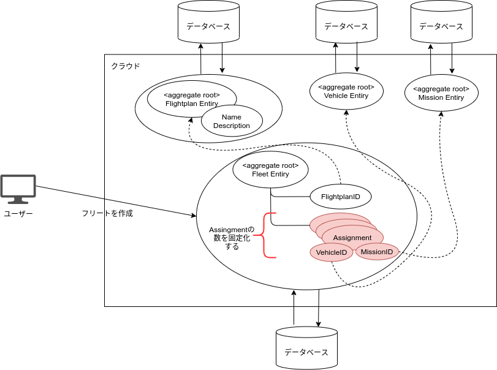

# 本編3 飛行の計画とドメイン間の参照関係

当ドキュメントでは、Skysignが提供する機能の一つである、飛行計画に関する
ドメイン・モデルの解説を行っていきます。

## 飛行計画とは
飛行計画（フライト・プラン）は航空用語であり、航空機を飛行させるために作成する、
飛行予定に関する計画のことです。

[飛行計画 - Wikipedia](https://ja.wikipedia.org/wiki/%E9%A3%9B%E8%A1%8C%E8%A8%88%E7%94%BB)

航空管制の世界では、この飛行計画とレーダーから取得した実際の航空機の位置を
照らし合わせて、航空管制業務に役立てています。

さて、Skysignの機能の一つである飛行計画は、このようなオカタイものではなくて、

- 登録されたドローンとミッションを紐づける
- ユーザーが一度の飛行で扱える`ドローンの機体数`を決める

という役割を担っている、ドメイン・モデルになります。  
飛行計画としては、本来であれば、飛行予定の時刻などの、計画として有用な情報も
含めるのが理想ですが、Skysignでは現状では紐づけ以上のことは行っていません。  
（モデリングの例として、シンプルに保ちたかったためです）

## 艦隊編成という新しい概念の導入
有人航空の世界と違い、ドローンの業務での利用シーンでは、一度のオペレーションで
飛行させるドローンの数は、単機とは限らないと考えられます。  
例えば、たくさんのほ場とドローンを持つ農家のオペレーターが、
一人でサービスの画面から複数のドローンに対して、一斉にすべてのほ場に
農薬散布するようなオペレーションです。

Skysignは、プロダクト・コンセプトとして、Flytbaseという海外のドローン・ベンチャーの
プロダクトに多大なる影響を受けています。

[Drone Fleet Survey and Mapping Solution - flytbase.com](https://flytbase.com/survey/)

Flytbaseでは、複数ドローンの同時飛行を効率化するための、ダッシュボード機能を実装し、
クラウドサービスとして展開してます。  
このサービス・イメージをWebサイトで確認してみると、地図に複数のミッションと、
複数の機体の情報を表示し、フリート（艦隊）・マネジメントできるようになっています。

ということで、Skysignの飛行計画も、このフリート（艦隊）という概念を導入しました。  
飛行計画のドメイン・モデルは次のとおりです。

飛行計画とフリートの集約ルートの関係も、機体とコミュニケーションの関係と同じく、
`アイデンティティとステートの関係`にあります。  
飛行計画の状態として重要な要素はフリートの方に集中しており、フリートのみを
単独で更新するようにすることで、飛行計画の名称や説明欄の更新と競合しないようにできます。

## 分散環境で整合性を取るために
さて、フリートのドメイン・モデルはこれで問題ないように見えますが、
１点議論の余地があります。  
それは、依存しているミッションや機体の集約ルートが削除されたら、
このフリートの参照状態はどうなるでしょうか？  
もちろん、ミッションや機体の識別子が示すリソースが消えてしまうので、
不整合となってしまいます。

この場合、取りうるアクションとしては、

- 飛行計画で参照されている場合、ミッションや機体は削除できないようにする
- ミッションや機体の削除時に、参照している飛行計画の識別子をクリアする

の、どちらかとなるでしょう。

まず、前者を考えてみます。

一般的に、強い整合性の関係にあるデータ同士は、`同じトランザクション内`で
更新をかけることで、整合性を保つように設計します。  
しかしながら、マイクロサービスによる分散アーキテクチャで構築されたSkysignでは、
飛行計画とミッション・機体の集約ルートは、同じトランザクション内で更新できません。  
また、ミッションや機体の削除時に、飛行計画に対してAPIでチェックを行ったとしても、
`確実に整合性を取ることはできない`のです。

モノリシックなアーキテクチャで開発する分には、ソフトウェア全体でのデータベース
アクセスに対してトランザクションを張ってしまう設計をしても良いかと思います。
これは、いわゆる、`トランザクション整合性`というパターンです。

さて、それでは、後者はどうでしょうか？

ミッションや機体が削除されたとき、関連するコンテキスト境界に対して通知を送り、
関連したリソースが削除されたことを伝えます。  
通知されたそれぞれのコンテキスト境界内では、当該リソースを示す識別子を保有していたら、
その識別子をクリアすることで、参照状態を解除できます。

これは、DDDの文脈では、`結果整合性`と呼ばれるパターンです。

Skysignでは、もちろん、こちらを採用しています。  
（ただし、例に挙げたリソース削除時の識別子のクリアは、現状実装されていません）

## 直接参照を避けることで、疎結合を維持する
機体のリソースが削除されたことで、関連するフリート上の機体の識別子がクリアされました。  
このとき、フリートの構成として５機編成としていたところを、削除により４機に変化
してしまったとすると、フリートというドメインとして、どのような説明となるでしょうか？

「フリートを構成するドローンが１機消えたことにより、`艦隊編成`が崩れた」となります。

艦隊という概念を考えてみると、私は以下の図のようなイメージを想像しました。  
（私は軍事には詳しくないですが、一生懸命イメージしました…）

根本的に、何らかの計画を立てる場合、重要なのは「何を使うか」という具体的な話よりも、
「何を目指し、どのように取り組むのか？」という、目的が先行するはずです。

よって、飛行の計画上５機で目的を達成したいのであれば、計画として「５」
という`枠を用意`して、その枠に、`持ち玉の機体やミッションを割り当てる`、
という操作が、最も認識しやすい説明になります。

よって、フリートのドメイン・モデルに`アサインメント（割り当て）`というエンティティを
追加し、アサインメントが艦隊編成の固定枠として機能するようにモデリングしました。

ミッションと機体の識別子は、アサインメントのそれぞれのフィールドに設定／除去でき、
すべてのアサインメントの識別子の枠が設定済みである場合、その飛行計画は
「実行（飛行）可能」であると判断できる仕組みです。

異なるコンテキスト境界への参照は、直接的にではなく、間接的に依存するようにすることで、
境界内のドメイン・モデルの守るべき制約を外部に漏らすことなく、維持することができました。

--- 

本編Part.3は、ここで終わりです。  
次のPart.4では、いよいよ実際のドローンの遠隔飛行に入っていきます。